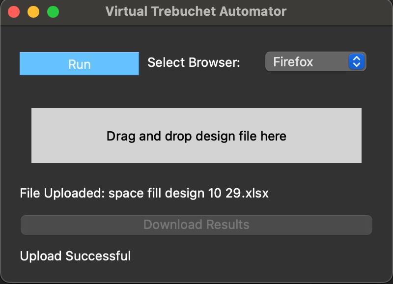

# auto-trebuchet
Welcome to the Auto-trebuchet project!



## Description
This application facilitates education in running [Design of Experiements (DOE)](https://en.wikipedia.org/wiki/Design_of_experiments) in [JMP Statistical Software](https://www.jmp.com/en_us/home.html) using a [Virutal Trebuchet](virtualtrebuchet.com).

Would you like hands on experience setting up a DOE in JMP to optimize your responses?<br>
Do you want to see which parameters have the greatest effect on your experiment results?<br>
Then try out our application and see if you can find the best parameters to optimize the height, distance, and time of an object being released by a trebuchet!

## Prerequisites
Before you begin, ensure you have met the following requirements:
- **Python**: Your system should have Python 3.12.0 installed. You can download Python from [python.org](https://www.python.org/downloads/).
- **pip**: Make sure you have `pip` installed, as it is used to install Python packages.

## Installation
1. Clone the repository to your local machine:
   ```sh
   git clone https://github.com/gpdefilippo/auto-trebuchet.git
2. Change the directory to your project folder:
   ```sh
   cd auto-trebuchet
3. Create a virtual environment (optional but recommended):
   ```sh
   python -m venv venv
   ```
   a. Activate the virtual environment:
   * On Windows:
     ```sh
     venv\Scripts\activate
   * On macOS and Linux:
     ```sh
     source venv/bin/activate
4. Install the required packages from requirements.txt:
  ```sh
  pip install -r requirements.txt
  ```

## Usage
Run the application with the following command:
```sh
python application.py
```
1. A design file (.xlsx) is needed to run your experiement (see example design files in *'auto-trebuchet/designs'*)
   * For our application we created designs that vary the virtual trebuchet's 'Length of Short Arm', 'Weight of Mass', and 'Release Angle'
   * Try to think of a good range for these values that will allow the trebuchet to properly fire and to optimize the height, distance, and time of the object
   * Input as many iterations of experiements as you like, but always try to find the minimum amount of trials to save time and money
2. Drag and drop your design file until the application
3. Select web browser to use for automation
4. If design file is accepted, click 'Run'
5. Once the design has finished running, download the file by clicking 'Download Results'

Now that we have the results from the Virtual Trebuchet, you can now analyze the results in JMP.<br>
Look for which parameters have the greatest impact and see if you can design another experiement to further optimize!<br>

